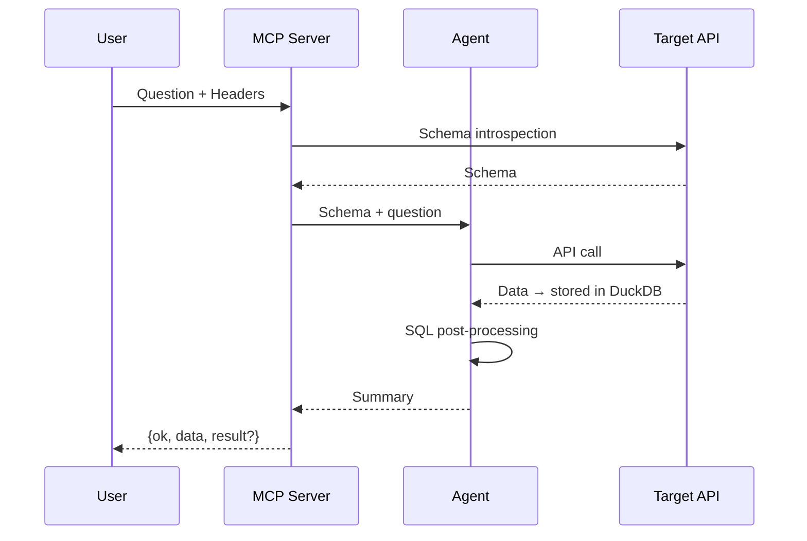
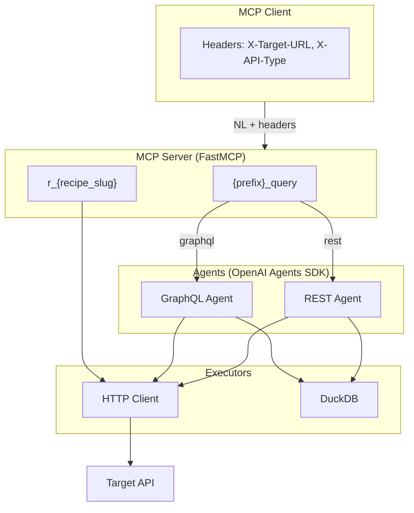
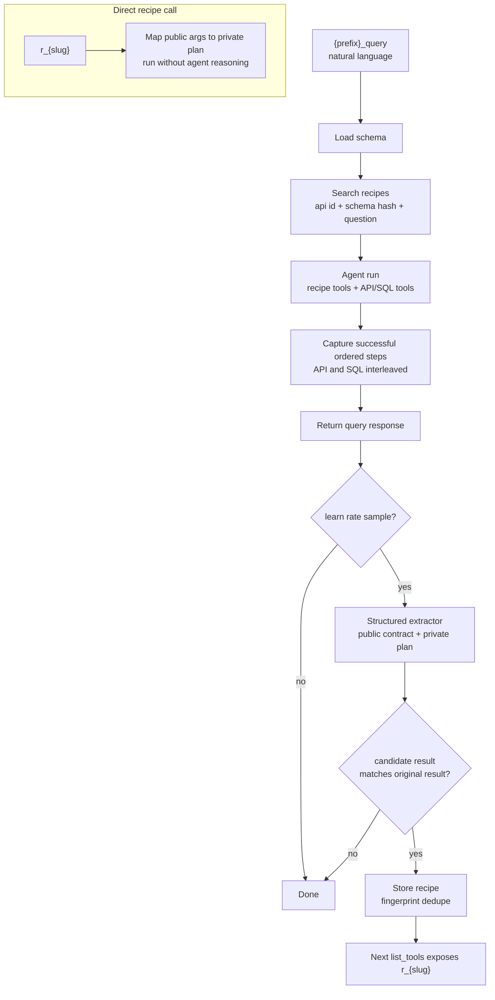

# API Agent

**Turn any API into an MCP server. Query in English. Get results even when the API can't.**

Point at any GraphQL or REST API. Ask questions in natural language. The agent fetches data, stores it in DuckDB, and runs SQL post-processing. Rankings, filters, and joins over returned data work **even if the API doesn't support them**.

## What Makes It Different

**🎯 Zero config.** No custom MCP code per API. Point at a GraphQL endpoint, OpenAPI 3.x spec, or Swagger 2.0 spec. The agent introspects/loads schema automatically.

**✨ SQL post-processing.** API returns 10,000 unsorted rows? Agent ranks top 10. No GROUP BY? Agent aggregates. Need to join returned tables? Agent combines. The API doesn't need to support it—the agent does.

**🔒 Safe by default.** Read-only. Mutations blocked unless explicitly allowed.

**🧠 Recipe learning.** Agent samples successful queries into reusable workflows. Ask once, reuse cached pipelines that execute without LLM reasoning. Learned recipes are exposed as tools named `r_<tool_name>`.

## Quick Start

**1. Run:**

```bash
# Direct run (no clone needed)
OPENAI_API_KEY=your_key uvx --from git+https://github.com/agoda-com/api-agent api-agent

# Or clone
git clone https://github.com/agoda-com/api-agent.git && cd api-agent
uv sync --group dev
```

Set the OpenAI secret in env:

```bash
export OPENAI_API_KEY=your_key
```

Direct `uvx` runs use built-in defaults unless `API_AGENT_CONFIG` points to a
TOML file. A cloned checkout uses `api-agent.toml` from the repository root by
default.

**2. Start local clone:**

```bash
uv run api-agent

# Or Docker
docker build -t api-agent .
docker run -p 3000:3000 -e OPENAI_API_KEY=your_key api-agent
```

**3. Add to any MCP client:**
```json
{
  "mcpServers": {
    "rickandmorty": {
      "url": "http://localhost:3000/mcp",
      "headers": {
        "X-Target-URL": "https://rickandmortyapi.com/graphql",
        "X-API-Type": "graphql"
      }
    }
  }
}
```

**4. Ask questions:**
- *"Show characters from Earth, only alive ones, group by species"*
- *"Top 10 characters by episode count"*
- *"Compare alive vs dead by species, only species with 10+ characters"*

That's it. Agent introspects schema, generates calls, runs SQL post-processing.

## More Examples

**REST API (Petstore):**
```json
{
  "mcpServers": {
    "petstore": {
      "url": "http://localhost:3000/mcp",
      "headers": {
        "X-Target-URL": "https://petstore3.swagger.io/api/v3/openapi.json",
        "X-API-Type": "rest"
      }
    }
  }
}
```

**REST API with header auth (Xquik):**
```json
{
  "mcpServers": {
    "xquik": {
      "url": "http://localhost:3000/mcp",
      "headers": {
        "X-Target-URL": "https://xquik.com/openapi.json",
        "X-API-Type": "rest",
        "X-API-Name": "xquik",
        "X-Target-Headers": "{\"x-api-key\": \"YOUR_API_KEY\"}"
      }
    }
  }
}
```

Xquik is an independent third-party service. Not affiliated with X Corp. "Twitter" and "X" are trademarks of X Corp.

**Your own API with auth:**
```json
{
  "mcpServers": {
    "myapi": {
      "url": "http://localhost:3000/mcp",
      "headers": {
        "X-Target-URL": "https://api.example.com/graphql",
        "X-API-Type": "graphql",
        "X-Target-Headers": "{\"Authorization\": \"Bearer YOUR_TOKEN\"}"
      }
    }
  }
}
```

---

## Reference

### Headers

| Header                 | Required | Description                                                |
| ---------------------- | -------- | ---------------------------------------------------------- |
| `X-Target-URL`         | Yes      | GraphQL endpoint OR OpenAPI/Swagger spec URL               |
| `X-API-Type`           | Yes      | `graphql` or `rest`                                        |
| `X-Target-Headers`     | No       | JSON auth headers, e.g. `{"Authorization": "Bearer xxx"}`  |
| `X-Passthrough-Headers`| No       | JSON array of header names to copy from this MCP request onto outbound API calls (merged after `X-Target-Headers`) |
| `X-API-Name`           | No       | Override tool name prefix (default: auto-generated)        |
| `X-Base-URL`           | No       | Override base URL for REST API calls                       |
| `X-Allow-Unsafe-Paths` | No       | JSON array of glob patterns for POST/PUT/DELETE/PATCH      |
| `X-Poll-Paths`         | No       | JSON array of REST paths requiring polling                 |
| `X-Include-Result`     | No       | Truthy values include full `result` in wrapped output      |
| `X-Recipe-Learn-Rate`  | No       | Override recipe sample rate for this request, `0` to `1`   |
| `X-Debug`              | No       | Truthy values include `debug` metadata with calls and trace id when available |

`X-Passthrough-Headers` is a JSON array of header names, for example `["Authorization", "X-Request-Id"]`. For each name that appears on the MCP request (matching is case-insensitive), the value is copied into the headers sent to the target API. Use this when the client already sends auth or tracing headers on the MCP connection and you want those same values forwarded without duplicating them in `X-Target-Headers`. Entries missing from the request are skipped.

Truthy header values are `true`, `1`, and `yes` (case-insensitive). `X-Recipe-Learn-Rate: 1` always samples successful queries for recipe extraction; `0` disables learning for the request. Invalid optional JSON headers are ignored and default to empty values.

### MCP Tools

**Core tool** (prefix auto-generated from URL or `X-API-Name`):

| Tool               | Input                                                          | Output                          |
| ------------------ | -------------------------------------------------------------- | ------------------------------- |
| `{prefix}_query`   | Natural language question + optional `return_directly`         | `{ok, data, error, result?}` or CSV |

`X-API-Name` preserves hyphens in the prefix; the tool suffix separator remains `_`
(for example, `weather-alerts` exposes `weather-alerts_query`).

If a tool call used `return_directly`, the MCP response is raw CSV instead of the wrapper. Otherwise `data` contains the agent summary and `result` contains retrieved rows when available.

Set `X-Debug: true` to force wrapped JSON and include a `debug` object:

```json
{
  "ok": true,
  "data": "...",
  "debug": {
    "api_calls": [{"method": "GET", "path": "/users/{id}", "success": true}],
    "trace_id": "62ee6f56fc839a7291d09935a0974727"
  },
  "error": null
}
```

For GraphQL debug responses, calls are returned under `debug.queries`. For REST debug responses, calls are returned under `debug.api_calls`.

`debug.trace_id` is included only when OTEL tracing is enabled and a trace is active.

**Recipe tools** (dynamically added as the agent learns):

| Tool       | Input                                                         | Output          |
| ---------- | ------------------------------------------------------------- | --------------- |
| `r_{slug}` | Intent args                                                   | CSV             |

- Slug derived from LLM-suggested recipe name, max 49 chars total including `r_`.
- All declared tool args are **required** top-level fields.
- Recipe tools always return directly as CSV.

**Schema tools** (agent-internal):

During query planning, agents also have `search_schema(pattern, context?, before?, after?, offset?)` for grep-like regex search over raw GraphQL introspection or OpenAPI JSON. This is used when compact schema context is truncated.

### Configuration

App configuration lives in `api-agent.toml`. Environment variables do not override app settings except listed overrides. `API_AGENT_CONFIG` selects a TOML file path; Docker defaults it to `/app/api-agent.toml`. A cloned checkout reads `api-agent.toml` by default. Direct installed runs, including `uvx`, use built-in defaults unless `API_AGENT_CONFIG` points to a TOML file. `OPENAI_API_KEY` is env-only; `OPENAI_BASE_URL` and `PORT` can be set in TOML and overridden by env.

| TOML key | Default | Notes |
| --- | --- | --- |
| `[mcp].name` | `API Agent` | MCP display name |
| `[server].host` | `0.0.0.0` | bind host |
| `[server].port` | `3000` | bind port; env `PORT` may override |
| `[server].transport` | `streamable-http` | `http`, `streamable-http`, or `sse` |
| `[server].stateless_http` | `true` | stateless MCP HTTP mode |
| `[server].cors_allowed_origins` | `*` | comma-separated origins |
| `[server].debug` | `false` | debug logging |
| `[model].api` | `responses` | `responses` or `chat_completions` |
| `[model].name` | `gpt-5.5` | model name |
| `[model].openai_base_url` | `https://api.openai.com/v1` | env `OPENAI_BASE_URL` may override |
| `[model].reasoning_effort` | `low` | model reasoning effort |
| `[description].model_name` | `gpt-5.4-mini` | optional tool description model; empty uses `[model].name` |
| `[description].timeout_seconds` | `15` | tool description generation timeout |
| `[agent].max_turns` | `30` | max agent turns per query |
| `[agent].max_response_chars` | `50000` | max final response chars |
| `[agent].max_schema_chars` | `32000` | compact schema cap |
| `[agent].max_preview_rows` | `10` | result preview rows |
| `[agent].max_tool_response_chars` | `32000` | tool response context cap |
| `[polling].max_polls` | `20` | max REST poll attempts |
| `[polling].default_delay_ms` | `3000` | default REST poll delay |
| `[polling].max_delay_ms` | `3000` | max REST poll delay |
| `[recipes].enabled` | `true` | enable learned recipes |
| `[recipes].max_size` | `1000` | max stored recipes |
| `[recipes].learn_rate` | `0.2` | deterministic sample rate |
| `[storage].backend` | `memory` | `memory` or `redis` |
| `[storage].namespace` | `api-agent` | Redis key namespace |
| `[redis].url` | empty | required only for Redis storage |

Docker copies this TOML to `/app/api-agent.toml`, and `start.sh` sets `API_AGENT_CONFIG=/app/api-agent.toml` by default. Keep app settings in TOML, set `OPENAI_API_KEY` in env, and leave proxy/OTEL to env.

`[storage]` backs learned recipes and generated downstream tool descriptions. Generated descriptions are cached by API id and schema hash. If description generation fails or times out, API Agent returns a deterministic fallback and caches that fallback for 5 minutes before retrying generation.

---

## How It Works



## Architecture



**Stack:** [FastMCP](https://github.com/jlowin/fastmcp) • [OpenAI Agents SDK](https://openai.github.io/openai-agents-python/) • [DuckDB](https://duckdb.org)

Agents use the OpenAI Responses API model path by default. Set `[model].api = "chat_completions"` only for models/endpoints that support Chat Completions.

Current target scope: each query runs against one configured API target. Multi-endpoint support should expose multiple named targets, but cross-target joins are intentionally out of scope for now.

REST specs can be JSON or YAML. OpenAPI 3.x is used directly; Swagger 2.0 is normalized into an OpenAPI 3.0-compatible shape. For REST base URLs, the agent uses `X-Base-URL` first, then `servers[0].url`, then derives the origin from the spec URL.

---

## REST Polling

Set `X-Poll-Paths` to enable the `poll_until_done` agent tool for async REST endpoints:

```json
["/jobs", "/search"]
```

The agent must use `poll_until_done` for matching paths. It polls until `done_field` equals `done_value`, supports dot paths like `status` or `trips.0.isCompleted`, waits `[polling].default_delay_ms` by default, caps waits at `[polling].max_delay_ms`, stops after `[polling].max_polls`, and increments `body.polling.count` when present.

---

## Recipe Learning

Agent samples successful queries into reusable MCP tools. Recipe capture is best-effort after the user-facing query succeeds; recipe extraction/store failures are logged and do not fail the query response.

1. **Captures** - Records successful API and SQL tool calls into one ordered `steps` list.
2. **Samples** - Uses `X-Recipe-Learn-Rate` when present, otherwise `[recipes].learn_rate`.
3. **Extracts** - Structured extractor proposes a public MCP tool contract plus private optimized execution plan.
4. **Validates** - Runs the candidate once with fixture tool args and compares final rows to the original result.
   Extractor prompts receive bounded result samples; deterministic replay keeps the full local result.
5. **Caches** - Stores by API id + schema hash with fingerprint deduplication.
6. **Reuses** - Similar `{prefix}_query` requests get recipe tools injected for the agent to choose.
7. **Exposes** - Learned recipes are also published as direct MCP tools named `r_<tool_name>`.



**Recipe structure:**
- `public_contract` contains MCP `tool_name`, description, and public `tool_args`.
- `execution_plan.steps` is a dataflow graph. Each step has `id`, `kind`, `input`, and `output.name`.
- `input.mode="single"` uses public args via `input.with`; `map` and `batch` read one prior rowset via `input.from` + `input.bind`.
- Multiple dependencies must first be joined by SQL into one ordered binding rowset; there is no implicit Cartesian product.
- **GraphQL**: `call.query_template` with `{{param}}` placeholders.
- **REST**: `call.path_params`, `call.query_params`, `call.body` with `{"$var": "name"}` refs. List query params are encoded as repeated keys.
- **SQL**: `query_template` inside the same ordered `steps` list.

Mapped REST dependency shape:

```json
{
  "id": "key_results",
  "kind": "rest",
  "input": {
    "mode": "map",
    "from": "filtered_objectives",
    "bind": {"objective_id": "id"},
    "with": {}
  },
  "call": {
    "method": "GET",
    "path": "/objectives/{objective_id}/key-results",
    "path_params": {"objective_id": {"$var": "objective_id"}}
  },
  "output": {
    "name": "key_results",
    "attach_binding": ["objective_id"]
  }
}
```

`input.from` must name one prior `output.name`. For two upstream datasets, add a SQL step that joins them into one rowset first, then `map` from that SQL output.

**Recipe tools:**
- Each cached recipe is surfaced as an MCP tool named `r_{slug}` (slugified from LLM-suggested name, max 49 chars).
- Recipe names use concise `snake_case` action-resource slugs. Descriptions are outcome-focused and do not inject API labels or implementation step counts.
- If multiple recipes share the same slug, the most recently used one is exposed.
- Tool args are **flat top-level fields** (not nested under `params`), all required, and must be user-intent inputs.
- Clients call these tools directly — no LLM reasoning, just cached API+SQL pipeline.

For normal `{prefix}_query` calls, recipe reuse is still agent-mediated: matching recipes are exposed as tools and prompt hints, then the agent decides whether to call one. If the agent uses a recipe tool, that run is not learned again, and the recipe tool returns directly by default. Direct `r_{slug}` calls bypass the agent entirely and always return directly as CSV.

Recipes are hidden when schema changes (hash mismatch). Storage is memory by default or Redis when configured. Recipe eviction is FIFO by `recipes.max_size`; recipes have no TTL.

---

## Development

```bash
git clone https://github.com/agoda-com/api-agent.git
cd api-agent
uv sync --group dev
uv lock --check
uv run ruff check api_agent/ tests/
uv run ruff format --check api_agent/ tests/
uv run ty check
uv run pytest tests/ -q
```

Agent guidance lives in `AGENTS.md`. See [CONTRIBUTING.md](CONTRIBUTING.md) for
contribution guidelines and [CHANGELOG.md](CHANGELOG.md) for service history.

## Observability

OpenTelemetry tracing is opt-in. For local tracing, run through `opentelemetry-instrument`
and set either:

```bash
OTEL_SERVICE_NAME=api-agent OTEL_EXPORTER_OTLP_ENDPOINT=http://localhost:4318 \
  uv run --no-sync opentelemetry-instrument api-agent
# or
OTEL_SERVICE_NAME=api-agent OTEL_EXPORTER_OTLP_TRACES_ENDPOINT=http://localhost:4318/v1/traces \
  uv run --no-sync opentelemetry-instrument api-agent
```

`start.sh` uses `opentelemetry-instrument` automatically when an OTEL endpoint is configured, so Docker can use the same env vars without changing the entrypoint. API Agent exports OpenAI Agents SDK spans over OTLP HTTP. Works with Jaeger, Grafana Tempo, Arize Phoenix, and other OTLP collectors. When not configured, tracing setup is skipped; queries still run and `X-Debug` still returns calls, but `debug.trace_id` is omitted.
